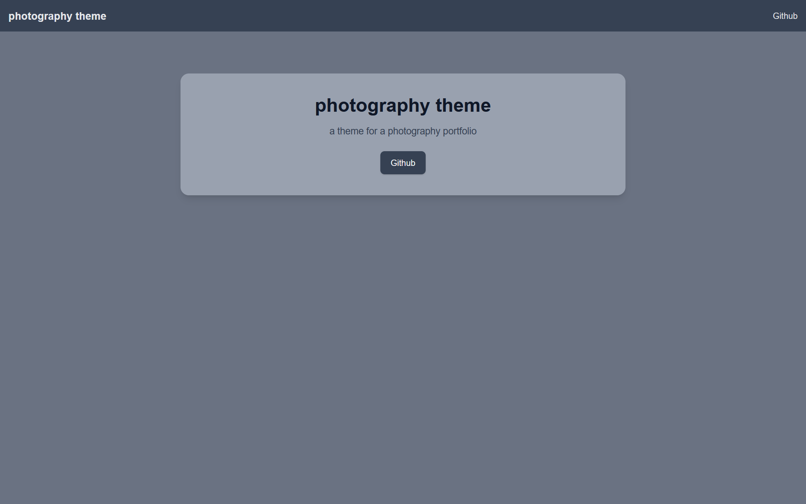

# photography website theme



## Installation

Initialise git:

```bash
git init
```

Add this theme to the `themes` folder:

```bash
git submodule add --depth=1 https://github.com/arbs09/photography-theme.git themes/photography
git submodule update --init --recursive
```

You can now enable the theme in your `config.toml`:

```toml
theme = "photography"
```

## Updating

Just run:

```bash
git submodule update --remote --merge
```

## Configuration

### Options

#### home / nav / footer links
You can edit the links on the homepage, in the nav and footer.

```toml
[extra]
home_links = [
    {url = "https://example.com", name = "Example"},
]
nav_links = [
    {url = "https://example.com", name = "Example"},
]
footer_links = [
    {url = "https://example.com", name = "Example"},
]
```

#### Copyright

For editing the copyright in the footer just use this:

```toml
[extra]
copyright = "Example"
```

#### Ai opt-out

If you want to opt out of (some) Ai Bots crawling your site you can add the following to your config.toml.

```toml
[extra]
no_ai = true
```
